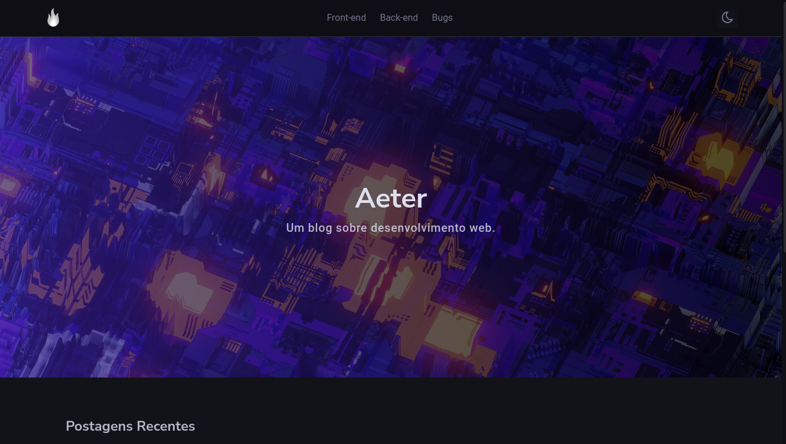

# Aeter - blogs sobre bugs e tecnologias

Um blogs Desenvolvido com next.js e notion como cms.

### Features

- [x] Adicionar Tags de seo na pagina com as publicações.
- [x] Adicionar pagina para os marcadores.
- [x] Adicionar botão de voltar ao top
- [ ] Adicionar estilo Mobile/Tablet
- [x] Adicionar cookie para controlar o a mudança de temas dark/light
- [x] Adicionar pagina com a listagem de todas as publicações
- [x] Criar um favicon/logo para o projeto.
- [x] Adicionar pagina de error 404/500
- [x] Resolver problema de decendência entre p < div
- [ ] Adicionar componente de imagem
- [ ] Criar cache
- [ ] cirar componente de description para os cards.